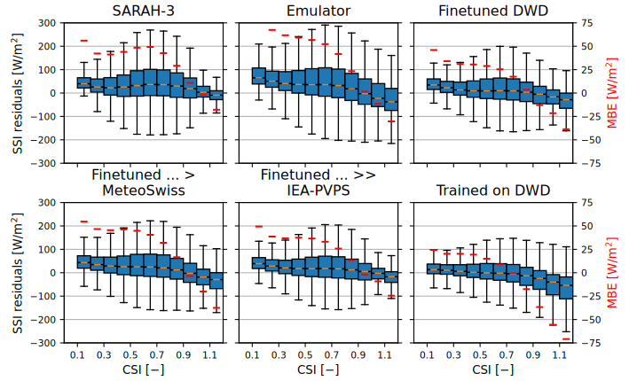

# Accurate generalizable deep learning surface solar radiation satellite retrieval over Europe.

This repository is the official implementation of [Accurate generalizable deep learning surface solar radiation satellite retrieval over Europe.](). 


## Requirements

To install requirements and Module, clone the repository and:

```setup
pip install -r requirements.txt
pip install -e ./irradiance_estimation
```

- Dataset downloads and aggregation into netcdf/zarr are found in the 'DATA' folder
- Preprocessing the data into colocated zarr datasets for each station and other extra steps are found in 'preprocess'

## Training

To train the paper's Emulator, run this command on a slurm server with 16 nodes (adjustable):

```train
sbatch run_trainer.sh
```

Or customize your own training with:
```train2
python train.py
```


To finetune the Emulator in the paper, follow the finetune.ipynb notebook.


## Evaluation

To evaluate my model follow the inference.ipynb in 'inference' directory. Other inference tasks are also included in other notebooks: feature_importance.ipynb, SARAH3_baseline.ipynb and image_inference.ipynb.

<!-- >📋  Describe how to evaluate the trained models on benchmarks reported in the paper, give commands that produce the results (section below). -->

## Pre-trained Models

Pre-trained models are available in ./train/SIS_point_estimation and ./train/SIS_point_estimation_groundstation
- Model A, Baseline: ./train/SIS_point_estimation_groundstation/6zy2qu70
- Model B, Emulator: ./train/SIS_point_estimation/jup3gn3n
- Model C, Finetuned on DWD: ./train/SIS_point_estimation_groundstation/hmobjerd
- Model D, Finetuned ... > MeteoSwiss: ./train/SIS_point_estimation_groundstation/4j9y9tqb
- Model E, Finetuned ... >> IEA-PVPS: ./train/SIS_point_estimation_groundstation/hg90jzjy


## Results
- An example of the retrievals:


- Evaluation of the metrics on all ground stations:


- Performance with respect to clear-sky index (CSI):



## Contributing

>📋  Pick a licence and describe how to contribute to your code repository. 
